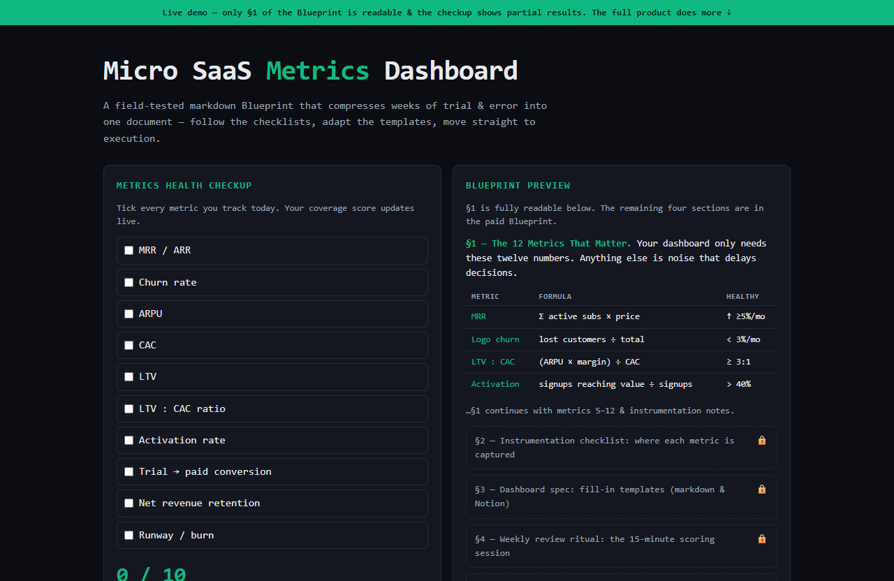

# Micro SaaS Metrics Dashboard — live demo

  

  <a href="https://amos-mig.github.io/micro-saas-metrics-dashboard-demo/"><strong>▶ Open the live demo</strong></a> ·
  <a href="https://amosmign.gumroad.com/l/micro-saas-metrics-dashboard"><strong>Get the full product · €7</strong></a>

## What this is

A live teaser of the Micro SaaS Metrics Dashboard Blueprint: an interactive health checkup that scores which of the 10 core metrics you actually track today, next to a readable preview of §1 of the playbook with the remaining sections locked. The full 5-section markdown Blueprint — instrumentation checklists, fill-in dashboard templates and stage benchmarks — is the paid product.

**Try it:** Tick the metrics you track today and watch your coverage score, grade and gap list update live, then click any locked section to preview what the full Blueprint adds.

## What you get in the full product

- Step-by-step structure — know exactly what to do next
- Checklists and tables you can fill in and reuse
- Written from real-world practice, not theory
- Instant digital download — read it in any markdown viewer or Notion

## About

- **Storefront:** [kits.amosmignery.dev](https://kits.amosmignery.dev) — single-file products, instant download, commercial license
- **Checkout:** [Gumroad](https://amosmign.gumroad.com/l/micro-saas-metrics-dashboard) (Merchant of Record, VAT handled)
- **Full product:** [Micro SaaS Metrics Dashboard](https://amosmign.gumroad.com/l/micro-saas-metrics-dashboard) · €7

## License

The demo page in this repo is MIT-licensed — reuse the technique, not the product.
The **Micro SaaS Metrics Dashboard** itself is not included here and is not free software.
